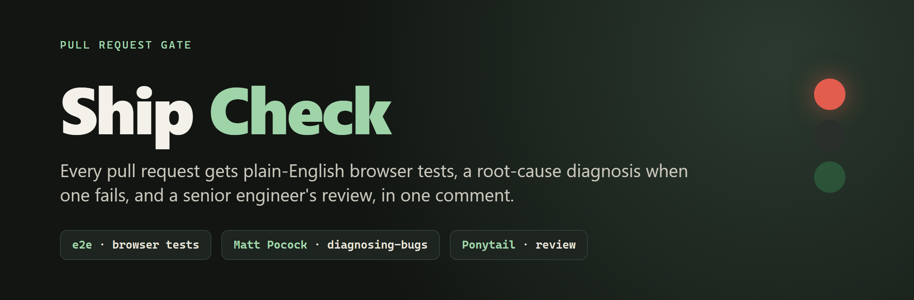
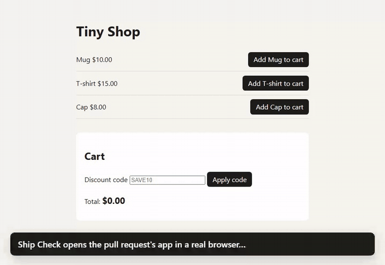
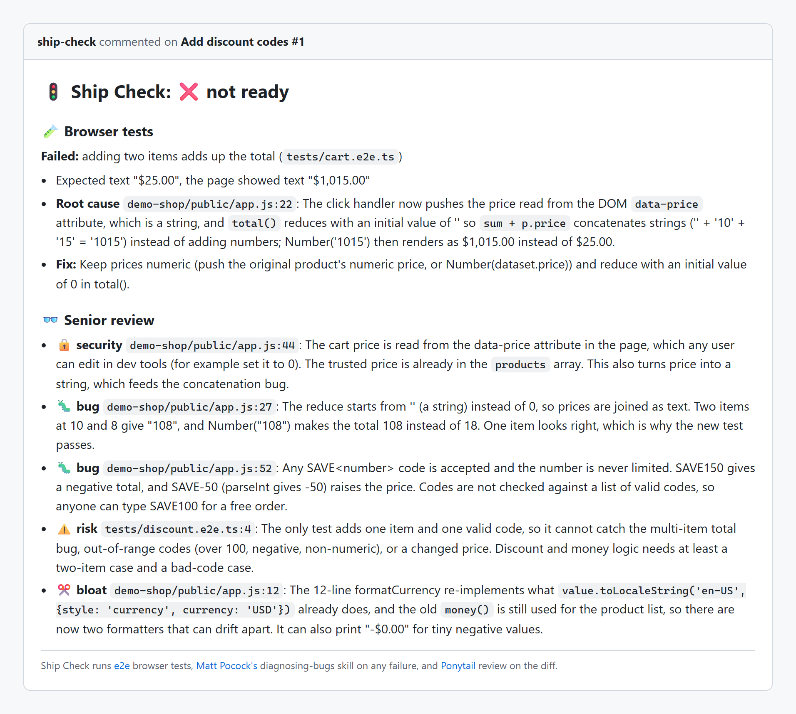
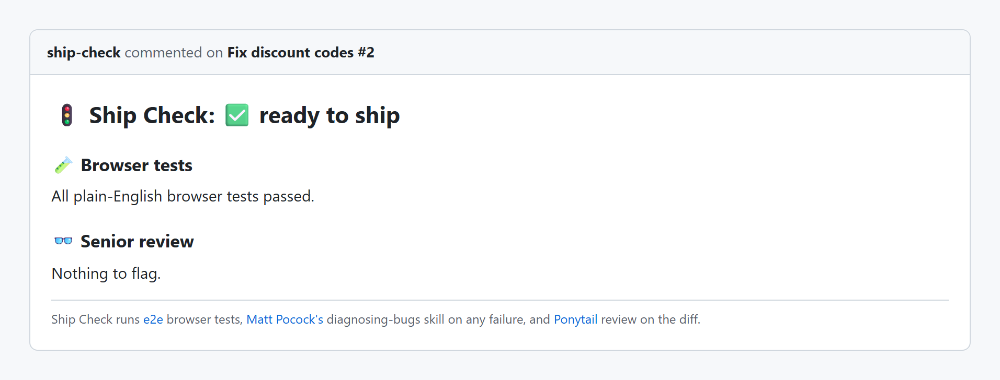
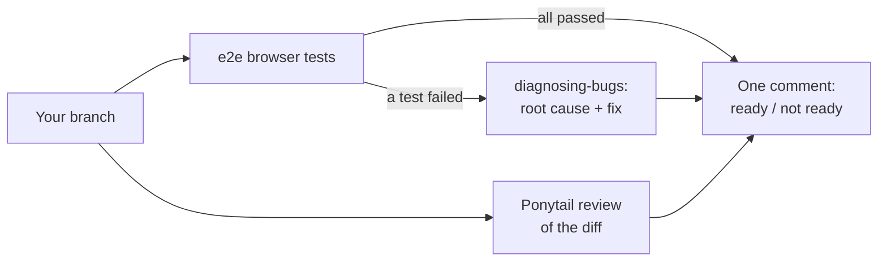

<p align="center"></p>

**Ship Check** looks at a pull request the way a careful senior engineer and a QA tester would, and tells you in one comment whether it is ready to ship.

1. **It tests the app in a real browser.** Tests read like a person clicking through the app, via [e2e](https://github.com/tester-army/e2e).
2. **When a test fails, it finds out why.** [Matt Pocock's `diagnosing-bugs` skill](https://github.com/mattpocock/skills) traces the failure to the line that caused it.
3. **It reviews the change.** [Ponytail's review](https://github.com/DietrichGebert/ponytail) reads the diff like the engineer who gets paged when it breaks: bugs, security holes, and code that should not exist.

<p align="center"></p>

## What it caught

This repo is its own demo. [`add-discount-codes`](../../compare/main...add-discount-codes) adds a discount box to a tiny shop and, like many real changes, breaks something nobody was looking at. Ship Check's verdict:

<p align="center"></p>

The browser test caught the $1,015 total. The diagnosis named the line and the fix. The review found what no test covered: prices read from the page (editable in dev tools), discount codes that go negative or past 100%, and a hand-written currency formatter duplicating one that already existed.

After [`fix-discount-codes`](../../compare/main...fix-discount-codes):

<p align="center"></p>

## How it works



`ship-check/ship-check.mjs` is about 120 lines of glue. Nothing from the three projects is copied into this repo: e2e is an npm dependency, and the two skills are fetched from GitHub at the exact commits listed in [`ship-check/skills.mjs`](ship-check/skills.mjs).

## Try it

You need Node.js 24.8 or newer, git, and [Claude Code](https://claude.com/claude-code) signed in. The AI steps run through it, on your own plan.

```bash
git clone https://github.com/Today-In-Ai-Builds/ship-check && cd ship-check
npm ci --ignore-scripts                 # nothing runs at install time
npx playwright-core install chromium    # the browser e2e drives

git checkout add-discount-codes
npm run ship-check                      # writes ship-check-report.md
```

On your own project, add tests under `tests/` ([e2e's docs](https://e2e.tester.army/docs)), point `e2e.config.ts` at your app, and run `npm run ship-check` on a branch. `--base <branch>` compares with something other than `main`. `--post` also posts the comment on the branch's pull request with the GitHub CLI.

## Security

Ship Check feeds code that anyone can write into an AI model, so it assumes that code is hostile:

- **The model gets no tools.** Claude Code runs with `--tools ""` and `--safe-mode`: it cannot run commands, read or write files, use the network, or load your plugins, hooks or settings. It only reads the prompt and answers. It is launched without a shell, so those flags reach it intact.
- **The skills are pinned.** Each skill is fetched at a fixed commit and checked against a SHA-256 of the version that was reviewed. If either repo changes, Ship Check refuses to run it until someone reviews the new version and updates the pin.
- **Its own output is not trusted.** Text from the model is stripped of HTML, links and @mentions before it goes into a comment.
- **It fails closed.** A diff too large to review in full is marked *not ready*, never passed. A test report left over from an earlier run is refused.
- **No GitHub Actions workflow yet.** In CI, a pull request's own tests would run in the same job as your API key, so a safe setup needs the tests and the AI steps in separate jobs. Until that exists, run Ship Check locally on branches you trust.

## Credits

Ship Check is glue around three projects that do the real work:

| Project | What it does here | License |
| --- | --- | --- |
| [tester-army/e2e](https://github.com/tester-army/e2e) | Runs the plain-English browser tests | Apache-2.0 |
| [mattpocock/skills](https://github.com/mattpocock/skills) (`diagnosing-bugs`) | Finds the root cause of a failure | MIT |
| [DietrichGebert/ponytail](https://github.com/DietrichGebert/ponytail) (`ponytail-review`) | Reviews the change | MIT |

Ship Check's own code is [MIT](LICENSE).

---

Built for a *Today in AI* episode as a working example of combining three tools. It is a demo, not a maintained product: issues and pull requests may not get answers.
